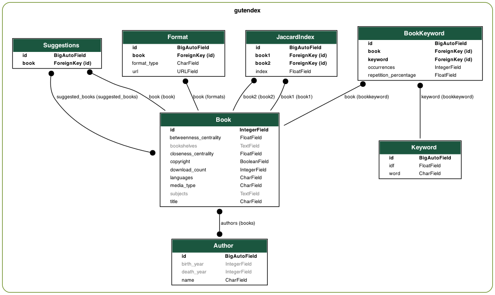

\newpage

# Introduction

Ce rapport présente le développement d'une application multisupport de moteurs de recherche de documents dans une bibliothèque de livres au format textuel. Une application multisupport se distingue d'une simple page web par sa capacité à interagir avec l'utilisateur, offrant des fonctionnalités dynamiques et réactives.
Ce projet met l'accent sur deux aspects essentiels : la pertinence et la performance du moteur de recherche. La pertinence est évaluée à l'aide de tests utilisateurs, tandis que la performance est mesurée à travers les temps de réponse du moteur de recherche.

# Setup

## Installation

### Backend

- Python >= 3.12
  - [Django](https://www.djangoproject.com/)
  - [Nltk](https://www.nltk.org/)
  - [Networkx](https://networkx.org/)
  - [Requests](https://docs.python-requests.org/en/master/)

```bash
pip install django djangorestframework nltk requests networkx
```

### Construction de la base de données

La base de données n’est pas incluse dans le rendu. Vous devez la construire vous-même, cela prend BEAUCOUP DE TEMPS ET DE RESSOURCES.

```bash
cd backend
python manage.py makemigrations
python manage.py migrate
python manage.py scrape_books
python manage.py create_indexTable
python manage.py create_metadata
```

### Frontend

- [Flutter](https://flutter.dev/)

Pour installer [Flutter](https://flutter.dev/), voir la [documentation officielle](https://flutter.dev/docs/get-started/install).

\newpage

## Démarrage

### Backend

Pour démarrer le serveur, exécuter la commande suivante :

```bash
cd backend
python manage.py runserver
```

### Frontend

Pour démarrer l’application frontend, exécuter la commande suivante :

```bash
cd frontend
flutter pub get
flutter run
```

Puis choisissez l’appareil sur lequel vous souhaitez exécuter l’application.

# Backend

## Architecture

Le back est basé sur le framework Django, qui est un framework web Python de haut niveau qui encourage un développement rapide et une conception propre et pragmatique.

Au vu de la taille du projet, nous avons opté pour une architecture simple de type monolithique, car elle est plus facile à gérer et à déployer. Cependant, nous avons pris soin de séparer les partis métiers et les parties de gestion de la base de données.

### Base de données

- `backend/gutendex/`
  - `management/commands/` : Commandes personnalisées pour la gestion de la base de données.
    - `create_indexTable.py` : Création de la table d'index inversé.
    - `create_metadata.py` : Création des métadonnées des livres, utilisées pour l'affichage des résultats de recherche, le filtrage et le tri.
    - `scrape_books.py` : Récupération des 1660 premiers à partir de l'API de [Gutenberg](https://www.gutenberg.org/).
  - `models.py` : Définition des modèles de données.

**Scraping (Farouck Cherfi) : **

\newpage

Voici à titre indicatif, un diagramme de la base de données :



### EndPoints

- `top-books/` : Récupération des livres les plus téléchargés.
- `search/<sentence or regex>/` : Recherche de livres par phrase.
- `book/<bookid>/` : Récupération d'un livre par son identifiant.
- `suggest/<bookid>/` : Suggestions de recherche.

## Recherche

- `backend/gutendex/helpers.py` : Fonctions de recherche.

Le moteur de recherche est basé sur l'indexation inversée des livres.
Une fois nos livres compatibles avec les mots clés récupérés, il est important de les classer par pertinence.

### Heuristiques

Pour notre heuristique de classements, nous avons utilisé 3 valeurs :

- **AVERAGE TF-IDF** : Term Frequency-Inverse Document Frequency est une mesure statistique utilisée pour évaluer l'importance d'un mot dans un document par rapport à une collection de documents ici on utilise une version modifiée afin de prendre en compte un ensemble de mots clés.

Voici la formule utilisée pour calculer le TF d'un terme pour un document:
    $$TF(t) = \frac{\text{Nombre de fois où le terme apparaît dans le document}}{\text{Nombre total de termes dans le document}}$$
Voici la formule utilisée pour calculer l'IDF d'un terme:
    $$IDF(t) = \log\left(\frac{\text{Nombre total de documents}}{\text{Nombre de documents contenant le terme}}\right)$$

- **Betweenness Centrality** : Elle mesure le nombre de fois qu'un nœud est sur le chemin le plus court entre deux autres nœuds.

- **Closseness Centrality** : Elle mesure la distance moyenne entre un nœud et tous les autres nœuds.

Les deux dernières valeurs étant basées sur des graphes, voici sa construction :

Soit $G = (V, E)$ un graphe géométrique où $V$ est l'ensemble des livres et $E$ l'ensemble des arêtes.

On construit $E$ de la manière suivante :

- On determine la moyenne des similarités de Jaccard entre chaque livre
  $$ k = \frac{1}{|V|*|V|-1}\sum\_{v,u \in V*V} \text{Jaccard}(u, v)\ u \neq v$$
- Pour éviter de se connecter a trop de livres, on augemente $k$ de 30%.
  $$ threashold = k + 0.3k$$
$$ E = \{(u, v) \in V \times V \mid \text{Jaccard}(u, v) \geq threashold\}$$

Une fois ses valeurs calculées, on les combine pour obtenir un score de pertinence d'un livre par rapport à un ensemble de mots clés

$$Score(Keywords, Book) = 0.7*\text{AVG-TF-IDF}(Keywords, Book)$$
$$ +\ 0.15*\text{Betweenness}(Book) + 0.15*\text{Closeness}(Book)$$

\newpage
## Suggestions

Dans le but d'améliorer l'expérience utilisateur, nous avons implémenté un système de suggestions de recherche. Ce système est basé sur la recherche de livres similaires à celui sélectionné par l'utilisateur.

Nous avons utilisé essayer deux approches pour déterminer la similarité entre les livres :

### Similarité par le titre

Ici, l'approche est basée sur le titre du livre.
La méthode est la suivante :

1. On récupère les mots clés du titre.
2. On relance une recherche avec les deux mots clés ayant le plus grand IDF.
3. On retourne les résultats.

### Similarité par le contenu

Ici l'approche place plus d'emphase sur le contenu,
La méthode est la suivante, on récupère simplement les livres connectés sur le graphe
décrit [précédemment](#heuristiques).

### Comparaison

Nous avons choisi après plusieurs tests d'éliminer la première méthode, car dans les cas où le titre contient des mots très courants, la recherche n'est pas pertinente.
Un exemple de titre non pertinent est "Le Rouge et le Noir", les mots clés Rouge/Noir ne permettent pas de déterminer des informations sur le contenu du livre et donc notre [AVG-TF-IDF](#heuristiques) n'est pas pertinent, invalidant la méthode de scoring.

## Performance

Dans cette section, nous allons discuter de la performance de notre moteur de recherche.
Nous avions un objectif principal :

- Réduire le temps de réponse du moteur de recherche

Pour ce faire, nous avons utilisé une technique principale le précalcul, ainsi nous avons precalculé les valeurs de [Betweenness](#heuristiques), [Closeness](#heuristiques), [TF-IDF](#heuristiques) pour chaque livre et chaque mot clé.

### Tests

# Frontend

# Conclusion
