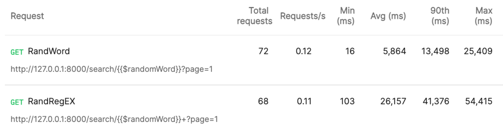

\newpage

# Introduction

Ce rapport présente le développement d'une application multisupport de moteurs de recherche de documents dans une bibliothèque de livres au format textuel. OpenYourMind est une application web et mobile qui se distingue par sa capacité à interagir avec l'utilisateur, offrant des fonctionnalités dynamiques et réactives.
Ce projet met l'accent sur deux aspects essentiels : la pertinence et la performance du moteur de recherche. La pertinence est évaluée à l'aide de tests utilisateurs, tandis que la performance est mesurée à travers les temps de réponse du moteur de recherche.

# Choix Technologique
Pour développer notre application, nous avons opté pour Flutter pour le développement de l'interface utilisateur et Django pour le backend afin de créer une plateforme robuste, performante et conviviale. En choisissant Flutter, nous bénéficions d'un framework cross-platform permettant une conception fluide pour les utilisateurs iOS, Android et web. De plus, ce langage offre une bibliothèque de widgets personnalisables très riche, ce qui rend le développement Front-end beaucoup plus simple. Concernant le Backend, nous avons choisi Django puisqu'il simplifie l'interaction avec la base de données grâce à son mapping d'objet relationnel. En outre, étant basé sur Python, Django offre une flexibilité pour intégrer des bibliothèques, telles que celles pour le traitement de chaînes de caractères et des graphes, facilitant ainsi le développement des fonctionnalités clés de notre moteur de recherche.


# Setup
Afin de tester notre motteur de recherche il est necessaire d'effecutuer les installations decrites dans cette section.

## Installation

### Backend

- Python >= 3.12
  - [Django](https://www.djangoproject.com/)
  - [Nltk](https://www.nltk.org/)
  - [Networkx](https://networkx.org/)
  - [Requests](https://docs.python-requests.org/en/master/)

```bash
pip install django djangorestframework nltk requests networkx
```

### Construction de la base de données

La base de données n’est pas incluse dans le rendu. Vous devez la construire vous-même, cela prend BEAUCOUP DE TEMPS ET DE RESSOURCES.

```bash
cd backend
python manage.py makemigrations
python manage.py migrate
python manage.py scrape_books
python manage.py create_indexTable
python manage.py create_metadata
```

### Frontend

- [Flutter](https://flutter.dev/)

Pour installer [Flutter](https://flutter.dev/), voir la [documentation officielle](https://flutter.dev/docs/get-started/install).


## Démarrage

### Backend

Pour démarrer le serveur, exécuter la commande suivante :

```bash
cd backend
python manage.py runserver
```

### Frontend

Pour démarrer l’application frontend, exécuter la commande suivante :

```bash
cd frontend
flutter pub get
flutter run
```

Puis choisissez l’appareil sur lequel vous souhaitez exécuter l’application.

# Backend

## Architecture

Le back est basé sur le framework Django, qui est un framework web Python de haut niveau qui encourage un développement rapide et une conception propre et pragmatique.
\newpage

- `backend/gutendex/`
  - `management/commands/` : Commandes personnalisées pour la gestion de la base de données.
    - `create_indexTable.py` : Création de la table d'index inversé.
    - `create_metadata.py` : Création des métadonnées des livres, utilisées pour l'affichage des résultats de recherche, le filtrage et le tri.
    - `scrape_books.py` : Récupération des 1660 premiers à partir de l'API de [Gutenberg](https://www.gutenberg.org/).
  - `models.py` : Définition des modèles de données.


### Base de données

Au vu de la taille du projet, nous avons opté pour une architecture simple de type monolithique, car elle est plus facile à gérer et à déployer. Cependant, nous avons pris soin de séparer les partis métiers et les parties de gestion de la base de données.


**Scraping (Farouck Cherfi) : **

\newpage

Voici à titre indicatif, un diagramme de la base de données :


### EndPoints

- `top-books/` : Récupération des livres les plus téléchargés.
- `search/<sentence or regex>/` : Recherche de livres par phrase.
- `book/<bookid>/` : Récupération d'un livre par son identifiant.
- `suggest/<bookid>/` : Suggestions de recherche.

## Recherche

- `backend/gutendex/helpers.py` : Fonctions de recherche.

Le moteur de recherche est basé sur l'indexation inversée des livres.
Une fois nos livres compatibles avec les mots clés récupérés, il est important de les classer par pertinence.

### Heuristiques

Pour notre heuristique de classements, nous avons utilisé 3 valeurs :

- **AVERAGE TF-IDF** : Term Frequency-Inverse Document Frequency est une mesure statistique utilisée pour évaluer l'importance d'un mot dans un document par rapport à une collection de documents ici on utilise une version modifiée afin de prendre en compte un ensemble de mots clés.

Voici la formule utilisée pour calculer le TF d'un terme pour un document:
    $$TF(t) = \frac{\text{Nombre de fois où le terme apparaît dans le document}}{\text{Nombre total de termes dans le document}}$$
Voici la formule utilisée pour calculer l'IDF d'un terme:
    $$IDF(t) = \log\left(\frac{\text{Nombre total de documents}}{\text{Nombre de documents contenant le terme}}\right)$$

- **Betweenness Centrality** : Elle mesure le nombre de fois qu'un nœud est sur le chemin le plus court entre deux autres nœuds.

- **Closseness Centrality** : Elle mesure la distance moyenne entre un nœud et tous les autres nœuds.

Les deux dernières valeurs étant basées sur des graphes, voici sa construction :

Soit $G = (V, E)$ un graphe géométrique où $V$ est l'ensemble des livres et $E$ l'ensemble des arêtes.

On construit $E$ de la manière suivante :

- On determine la moyenne des similarités de Jaccard entre chaque livre
  $$ k = \frac{\sum{v,u \in V*V} \text{Jaccard}(u, v)}{|V|*|V|-1}\ u \neq v$$
- Pour éviter de se connecter a trop de livres, on augemente $k$ de 30%.
  $$ threashold = k + 0.3k$$
$$ E = \{(u, v) \in V \times V \mid \text{Jaccard}(u, v) \geq threashold\}$$

Une fois ses valeurs calculées, on les combine pour obtenir un score de pertinence d'un livre par rapport à un ensemble de mots clés

$$Score(Keywords, Book) = 0.7*\text{AVG-TF-IDF}(Keywords, Book)$$
$$ +\ 0.15*\text{Betweenness}(Book) + 0.15*\text{Closeness}(Book)$$


## Suggestions

Dans le but d'améliorer l'expérience utilisateur, nous avons implémenté un système de suggestions de recherche. Ce système est basé sur la recherche de livres similaires à celui sélectionné par l'utilisateur.

Nous avons utilisé essayer deux approches pour déterminer la similarité entre les livres :

### Similarité par le titre

Ici, l'approche est basée sur le titre du livre.
La méthode est la suivante :

1. On récupère les mots clés du titre.
2. On relance une recherche avec les deux mots clés ayant le plus grand IDF.
3. On retourne les résultats.

### Similarité par le contenu

Ici l'approche place plus d'emphase sur le contenu,
La méthode est la suivante, on récupère simplement les livres connectés sur le graphe
décrit [précédemment](#heuristiques).

### Comparaison

Nous avons choisi après plusieurs tests d'éliminer la première méthode, car dans les cas où le titre contient des mots très courants, la recherche n'est pas pertinente.
Un exemple de titre non pertinent est "Le Rouge et le Noir", les mots clés Rouge/Noir ne permettent pas de déterminer des informations sur le contenu du livre et donc notre [AVG-TF-IDF](#heuristiques) n'est pas pertinent, invalidant la méthode de scoring.

## Performance

Dans cette section, nous allons discuter de la performance de notre moteur de recherche.
Nous avions un objectif principal :

- Réduire le temps de réponse du moteur de recherche

Pour ce faire, nous avons utilisé une technique principale le précalcul, ainsi nous avons precalculé les valeurs de [Betweenness](#heuristiques), [Closeness](#heuristiques), [TF-IDF](#heuristiques) pour chaque livre et chaque mot clé.

### Tests

Nous avons testé la performance de notre moteur de recherche sur un ensemble de 140 requêtes de type keyword/regex aléatoire.
Voici les résultats de nos tests :




# Frontend

## Architecture
Pour le FrontEnd, nous avons choisi de baser notre architecture sur le concept de séparation des préoccupations en organisant ainsi nos fihier selon leurs roles qui gerent un aspect precis de notre application.

- `/frontend/lib`
  - `main.dart` : Ce fichier constitue le point d'entrée de notre application.
  - `routes.dart` : Le fichier responsable de la gestion des routes de navigation au sein de l'application.
  - `theme.dart` : La gestion des aspects visuels et des styles de notre application se fait dans ce fichier.
  - `views` : Le dossier où on stocke les différents écrans/pages de votre application.
  - `components` : Répertoire des composants réutilisables de notre application.
  - `apis`
     - `apis/ApiCall.dart` : Ce fichier dans le dossier apis contient des fonctions pour effectuer des appels API vers le backend ou d'autres services externes.
  - `manager`
    - `manager/book_manager.dart` : La gestion de la logique métier se fait dans le dossier manager, plus précisément dans le fichier book_manager.dart, où l'on trouve les différentes opérations liées aux livres.
  - `models`
    - `models/book.dart` : Il s'agit du modèle de données pour représenter les informations sur les livres..
  

## Vues

Notre Application se compose pricipalement de 3 vues "Home", "result_page" et "book_description_page".

### Home

Pour la page d'accueil, nous avons opté pour un design simple et intuitif en intégrant notre composant app_bar_Custom et en plaçant au centre de la page notre barre de recherche, juste au-dessus de la section affichant les 10 meilleurs livres qui utilise le composant multiple_book qu'on detaillera par la suite. Lorsque la page est initialisée, la méthode initState() est appelée, chargée de récupérer les meilleurs livres à afficher en invoquant la méthode _loadTopBooks() du BookManager.

Cette méthode effectue une requête asynchrone pour obtenir les meilleurs livres à partir du backend. Une fois les données chargées, l'état de la page est mis à jour avec les livres récupérés en utilisant setState(). De plus, selon l'état de la variable books, une barre de progression circulaire est affichée pendant le chargement des données.

### Page resultat

La page resultat est un widget qui prend en paramètre search, le terme de recherche saisi par l'utilisateur.
Lorsque la page est initialisée (initState()), la méthode _loadResultBooks() est appelée pour charger les résultats de recherche pour la première page. La classe contient également une méthode _loadResultAndUpdateBooks() qui est appelée pour charger et mettre à jour les résultats de recherche. La méthode _searchAndUpdateBooks() est appelée lorsqu'une nouvelle recherche est effectuée dans la page resultat. Elle réinitialise les résultats de recherche actuels, met à jour le terme de recherche actuel et charge les nouveaux résultats de recherche.

Visuellement La page se compose d'ne AppBar personnalisée (AppBarCustom) mais qui contient une barre de recherche cette fois. Le corps de la page contient soit un indicateur de progression circulaire si les résultats de recherche sont en cours de chargement, soit la liste des résultats de recherche organisé avec une grille dans le composant multiple_book.Des boutons de navigation entre les pages sont également inclus pour permettre à l'utilisateur de passer aux résultats suivants ou précédents.

Le système de pagination mis en œuvre dans la classe ResultPage repose sur une gestion dynamique de l'état de la page courante (currentPage) et du terme de recherche actuel (currentSearch).l'état des boutons est ajusté en fonction de la disponibilité des résultats pour les pages correspondantes par exemple, si l'utilisateur se trouve sur la première page de résultats, le bouton "page précédente" est désactivé car il n'y a pas de page précédente à afficher. Lorsqu'un bouton est cliqué, la valeur de currentPage est mise à jour et les résultats de la nouvelle page sont chargés via une requête asynchrone, mettant à jour l'affichage des résultats.

### Page Book Description

Cette vue contient plusieurs éléments visuels pour présenter les détails d'un livre sélectionné : une image du livre, une carte affichant les informations détaillées du livre (les auteurs , la categorie ..), et un bouton qui ouvre un onglet dans le navigateur permettant à l'utilisateur d'acceder au lien qui contient le texte et de lire le livre. En dessous de ces details,  des livres suggérés sont disponibles, ils sont affichés sous forme de liste à l'utilisateur en utisant encore une fois notre composant multiple_book.

Lorsque la page est chargée, elle récupère une liste de livres suggérés basée sur le livre sélectionné à l'aide de la méthode _loadSuggestedBooks(). Cette méthode utilise une requête asynchrone pour obtenir les livres suggérés à partir du backend

## Composants

Comme mentionné précédemment, pour garantir la réutilisabilité de notre code, nous avons développé plusieurs composants dans notre application. Ces composants sont appelés à partir de différentes vues pour assurer une cohérence visuelle. Voici une brève description des composants les plus importants :

### App Bar

L'app bar est un element qui est present dans toutes les vues de notre application. Il permet d'afficher une app bar personnalisée avec la possibilité d'inclure une barre de recherche. 
Le composant prend en compte plusieurs attributs pour configurer son comportement :

- search: permet de spécifier le terme de recherche actuel.
- isSearchBar: indique si la barre de recherche doit être affichée.
- onSearch: définit une fonction de rappel appelée lorsqu'une recherche est soumise.
- isReset: contrôle la réinitialisation du composant lors de sa fermeture.

Visuellement le composant génère l'app bar en fonction de ces attributs : s'il faut afficher une barre de recherche, celle-ci est intégrée avec éventuellement un bouton de retour en arrière ; sinon, seul le logo de l'application est affiché au centre.

### La barre de recherche 

On ne peut certainement pas parlet d'un moteur de recherche sans le composant barre de recherche. Dans notre application, Cet element est conçu pour être flexible et adaptable qui peut être intégré dans l'app bar ou utilisée de manière autonome dans  d'autres pages. Ce composant prend en compte plusieurs attributs pour ajuster son comportement :

- search: qui représente le terme de recherche actuel, s'il y en a un.
- isAppbar: un booléen indiquant si la barre de recherche est intégrée dans l'app bar.
- onSearch: une fonction de rappel appelée lorsqu'une recherche est soumise.

Visuellement, on utilise un TextField, qui est configuré avec des options de style et de comportement en fonction des attributs spécifiés. L'apparence de la barre de recherche varie en fonction de la présence ou de l'absence d'une app bar, ainsi que de la valeur du texte saisi.

### Multiple Book

Le composant multiple_Book est conçu pour présenter une liste de livres dans Notre application. Il est egalement adaptable et peut pouvant utilisé tant pour afficher les résultats d'une recherche de livres que pour mettre en avant une sélection recommandée, suivant le contexte de l'application. Le widget prend ainsi en compte plusieurs attributs :

- isResultPage : un booléen indiquant si le widget est utilisé dans une page de résultats de recherche.
- books : une liste de livres à afficher.
- label : une chaîne de caractères représentant un libellé associé à la liste de livres, comme "Résultats de recherche" ou "Livres recommandés".

L'élement comprend un en-tête texte exposant le libellé spécifié, suivi d'une liste disposée horizontalement ou d'une grille verticale de livres, selon le contexte de l'application. Chaque livre est représenté par le composant Single_book, permettant une présentation détaillée de ses informations.

## Gestion cross-platform
Les composants de notre interface utilisateur sont conçus de manière à s'adapter de manière dynamique aux différentes tailles d'écran, offrant ainsi une experience agreable pour les utilisateurs web ou mobile. Cette adaptation est réalisée en utilisant des fonctionnalités telles que MediaQuery pour obtenir les dimensions de l'écran et ajuster les éléments en conséquence. Par exemple, dans le widget MultipleBook, la disposition des livres est adaptée en fonction de la taille de l'écran : une disposition en grille est privilégiée sur les écrans larges pour optimiser l'utilisation de l'espace, tandis qu'une liste verticale est préférée sur les écrans plus étroits pour faciliter la navigation et la lisibilité. Ce processus d'adaptation permet d'offrir une expérience utilisateur optimale, quel que soit le périphérique utilisé pour accéder à l'application.

\newpage
# Conclusion
En conclusion, le projet OpenYourMind est basé sur une conception centrée sur l'utilisateur pour créer un moteur de recherche de bibliothèque efficace et convivial. En utilisant les technologies Flutter et Django, nous avons pu exploiter les avantages de chaque technologie pour offrir une expérience utilisateur cohérente et réactive sur une variété de plateformes. L'utilisation de composants réutilisables, une architecture bien pensée et une attention particulière portée à la performance et à la pertinence du moteur de recherche ont permis de créer une application robuste et performante.